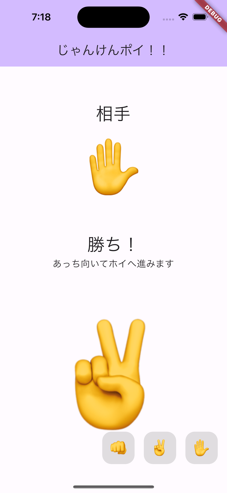
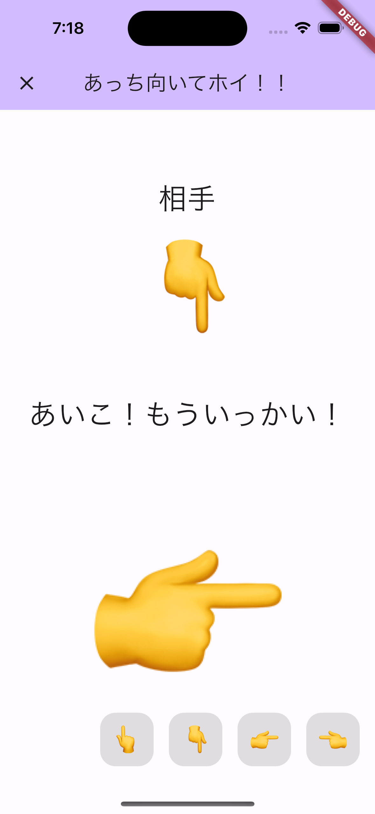
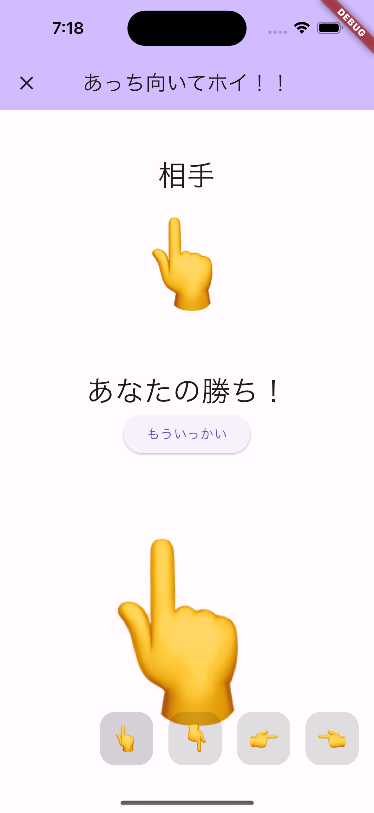

# flutter_univ_janken

Flutter 大学 じゃんけんアプリ

- じゃんけんの勝敗判定後、あっち向いてホイが始まります
- あっち向いてホイの勝敗とじゃんけんの勝敗を合算した、総合の勝敗が表示されます
- あっち向いてホイであいこの場合、自動でじゃんけん画面へ戻るようにしました
- 各ボタンを 2 度押しできないよう、isWaiting の状態管理を用いて不活性化しています

